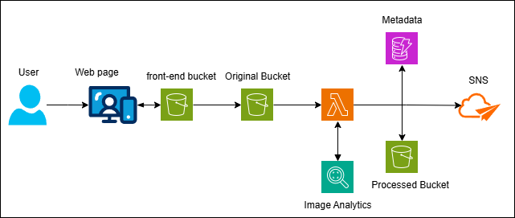

# Serverless Image Processing with AWS

A serverless image processing pipeline using S3, Lambda, Rekognition, and DynamoDB.  
**AWS Free Tier Friendly** - Stays within usage limits for SSA exam practice.

## Features
- Image resizing (200x200, 500x500)
- Auto-tagging with Rekognition AI
- Metadata storage in DynamoDB
- Email notifications via SNS
- Static frontend hosted on S3

## AWS Services Used
- **Compute**: AWS Lambda
- **Storage**: S3, DynamoDB
- **AI/ML**: Amazon Rekognition
- **Messaging**: SNS
- **Infrastructure**: SAM, IAM, CloudWatch

## Architecture


## Workflow

1. User Uploads Image via frontend hosted in s3 frontend-bucket
2. S3 Triggers Lambda
    - When a new object (image) is added to the "original" bucket, S3 automatically invokes the Lambda function.
3. Lambda Processes Image

    - The Lambda function:
        - Resizes the image to multiple sizes (e.g., 200x200, 500x500).
        - Analyze and label it via Rekognition.
        - The processed image is saved to the S3 "processed" bucket.
        - Store Metadata to DynamoDB. 
        - Notifications via SNS.

## 

## Setup

### Prerequisites
- AWS CLI configured
- SAM CLI installed 

### Deployment
1. Clone the repository:
   ```bash
   cd aws-image-processor
   ```

2. Edit your email in *`templat.yaml`*.

2. Build and deploy:
    ```bash
    sam build
    sam deploy --guided --capabilities CAPABILITY_IAM
    ```
    - Note: Accept defaults when prompted.

3. Confirm SNS Subscription:

    - Check your emailand confirm the SNS subscription.

## Testing

1. Visit the frontend URL (AWS Console → S3 → FrontendBucket → Properties → Static website hosting).

2. Upload a JPG/PNG image.

3. Verify:

    - Resized images in ProcessedBucket

    - Metadata in DynamoDB (image-metadata table)

    - Email notification in your inbox

## Cleanup

```bash
sam delete
```
